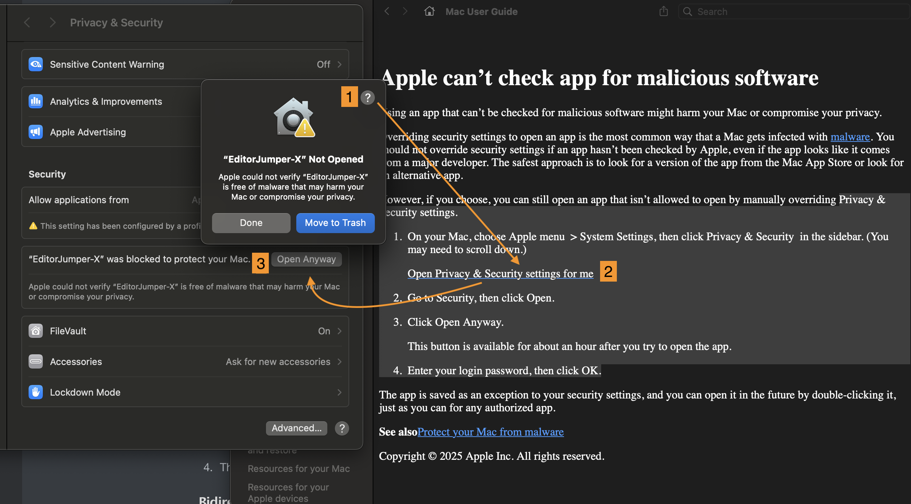

<div align="center">
  
  
  # EditorJumper-X
  
  A powerful Xcode extension that allows you to seamlessly jump from Xcode to Cursor editor at the exact line and column position.
</div>

## Features

- 🚀 Jump directly from Xcode to Cursor editor
- 📍 Preserves exact cursor position (line and column)
- ⚙️ Easy configuration through settings panel
- 🔄 Seamless integration with Xcode workflow

## Installation

### Option 1: Homebrew Cask (Recommended)

Install and update using Homebrew:

```bash
# Add the tap
brew tap xiangaoole/tap

# Install the app
brew install --cask xiangaoole/tap/editor-jumper-for-xcode
```

To update:

```bash
brew upgrade --cask xiangaoole/tap/editor-jumper-for-xcode
```

To delete:

```bash
brew uninstall --cask xiangaoole/tap/editor-jumper-for-xcode
```

### Option 2: Manual Installation

1. Download the latest release from the [Releases](https://github.com/xiangaoole/EditorJumper-X/releases) page
2. Drag the app to your Applications folder
3. Follow the setup instructions below

## Setup Instructions

> 📱 **For the best experience**: Download the app first, as it includes clickable buttons that open System Settings directly!

### Privacy & Security Settings (Required)



Our app uses AppleScript to get the current Xcode file location, which requires special permissions:

1. **On your Mac, choose Apple menu 🍎 > System Settings, then click Privacy & Security 🔒 in the sidebar.** (You may need to scroll down.)

   > 💡 **Quick Link**: [Open Privacy & Security settings](x-apple.systempreferences:com.apple.preference.security) *(This link works when viewing locally on macOS)*

2. **Go to Security, then click Open.**

3. **Click "Open Anyway".**
   
   *This button is available for about an hour after you try to open the app.*

4. **Enter your login password, then click OK.**

### Additional Setup

For other configuration steps, please refer to the prompts and instructions shown in the app's main interface after installation.

## Usage

1. Open Xcode and navigate to any file
2. Place your cursor at the desired position
3. Use the EditorJumper-X extension from Xcode's Editor menu
4. The file will open in Cursor at the exact same position

### Bidirectional Workflow

For jumping back from Cursor to Xcode, we recommend using [EditorJumper-V](https://github.com/wanniwa/EditorJumper-V), a VS Code extension that enables seamless jumping between modern code editors (VS Code, Cursor, Trae, Windsurf) and JetBrains IDEs, including Xcode support.

### Setting Up Keyboard Shortcuts (Recommended)

For the best experience, set up the keyboard shortcut **⇧ + ⌥ + O** for quick bidirectional jumping:

#### For Xcode "Open in Cursor" Menu Item:

1. **Open System Settings** on your Mac
   
   > 💡 **Quick Link**: [Open Keyboard settings](x-apple.systempreferences:com.apple.preference.keyboard) *(This link works when viewing locally on macOS)*

2. **Click "Keyboard Shortcuts..."** button
3. **Select "App Shortcuts"** from the left panel
4. **Click the "+" button** to add a new shortcut
5. **Choose "Xcode"** from the Application dropdown
6. **Enter "Open in Cursor"** as the Menu Title (exact text)
7. **Set the keyboard shortcut to** `⌘⌥O` (Cmd + Option + O)
8. **Click "Add"**

#### For Cursor (using EditorJumper-V):

1. **Install EditorJumper-V** extension in Cursor
2. **Open Cursor Settings** (⌘ + ,)
3. **Go to Keyboard Shortcuts**
4. **Search for "EditorJumper"**
5. **Set the same shortcut** `⌘⌥O` for the jump command

This creates a consistent keyboard shortcut for seamless bidirectional navigation between Xcode and Cursor.

## System Requirements

- macOS 10.15 or later
- Xcode 12.0 or later
- Cursor editor installed

## Troubleshooting

If you encounter issues:

1. Ensure Privacy & Security permissions are granted
2. Check that Cursor is properly installed and accessible
3. Restart Xcode after installing the extension
4. Check the app's settings panel for configuration options

## Contributing

Contributions are welcome! Please feel free to submit a Pull Request.

## License

This project is licensed under the MIT License - see the [LICENSE](LICENSE) file for details.

## Support

If you encounter any issues or have questions, please [open an issue](https://github.com/xiangaoole/EditorJumper-X/issues) on GitHub.

## Quick Links (macOS only)

*These links work when viewing this README locally on macOS:*

- 🔒 [Privacy & Security Settings](x-apple.systempreferences:com.apple.preference.security)
- ⌨️ [Keyboard Settings](x-apple.systempreferences:com.apple.preference.keyboard)
- 🔧 [Login Items & Extensions](x-apple.systempreferences:com.apple.LoginItems-Settings.extension)

*Note: These system links don't work in GitHub's web interface, but they work in the downloaded app and when viewing locally.*

## Version Policy

- Homebrew tap always provides the latest version
- Previous versions remain available as [GitHub Releases](https://github.com/xiangaoole/EditorJumper-X/releases)
- Users can upgrade with: `brew upgrade --cask xiangaoole/tap/editor-jumper-for-xcode` 